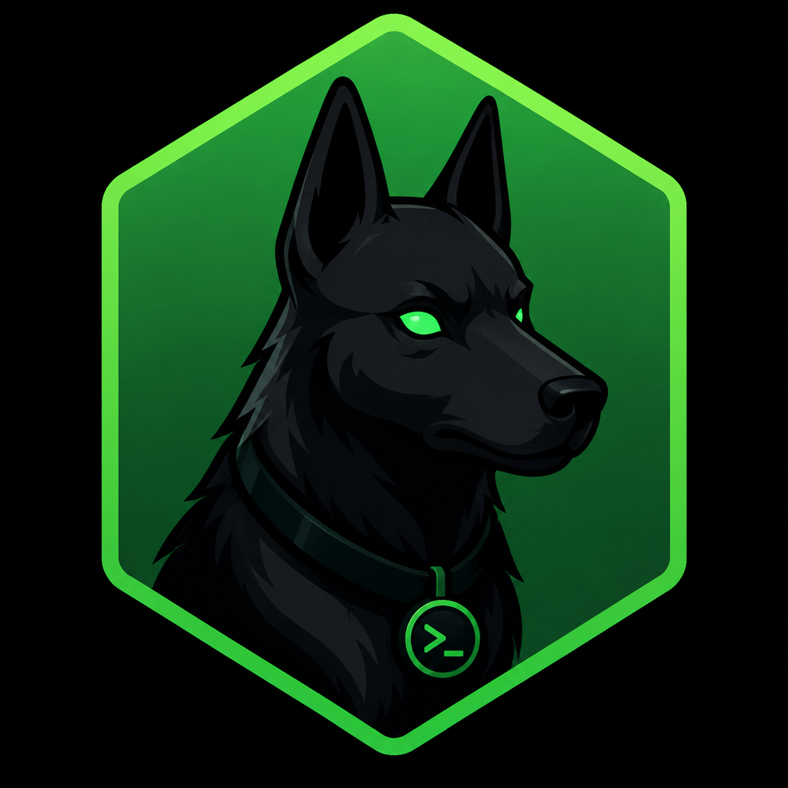

<p align="center">
  
</p>

<h1 align="center">DaemonHound</h1>

<p align="center"><strong>Opinionated local config and secret management for developers.</strong></p>

DaemonHound tracks, syncs, backs up, and manages important local developer files across machines — without any SaaS, dashboards, or accounts.

---

## Why

Developers often have:

- `.env.local` files spread across many repositories
- API tokens duplicated in multiple places
- Machine-specific configs worth backing up
- Multiple laptops/desktops that slowly drift apart

Most existing tools are either too complex (Vault, Doppler), require a SaaS subscription, or focus on dotfiles rather than secrets. DaemonHound solves this with a simple, local-first workflow backed by a private Git repository you own.

---

## Core Principles

- **Local-first** — your secrets never leave your machine unless you choose
- **Encryption by default** — everything sensitive is encrypted at rest using [age](https://age-encryption.org/)
- **Git-backed storage** — your own private Git repo is the backend
- **No SaaS** — no accounts, no subscriptions, no third-party servers
- **Opinionated over configurable** — sensible defaults, minimal config

---

## Getting Started

### First Machine

```bash
# Initialize DaemonHound with your private vault repo
dh init --remote git@github.com:you/my-vault.git

# Inside any project, start tracking files
cd ~/projects/pingpong-api
dh track .env.local
dh track .env.test

# Encrypt and push to the vault
dh sync
```

DaemonHound reads the `origin` remote, derives a namespace (`github.com/you/pingpong-api`), encrypts the file with your master password, and stores it in the vault. No manual configuration required.

### Second Machine

```bash
# Initialize with the same vault repo and master password
dh init --remote git@github.com:you/my-vault.git

# Move into the project directory (path can differ between machines)
cd ~/work/pingpong-api

# Sync — DaemonHound detects the namespace and restores tracked files
dh sync
# → github.com/you/pingpong-api: 2 tracked files found
# →   .env.local   ✓ restored
# →   .env.test    ✓ restored
```

No need to re-run `dh track` on the second machine. Once a namespace exists in the vault, `dh sync` handles everything automatically.

---

## How It Works

### Namespaces

DaemonHound uses **namespaces** as the primary abstraction. A namespace is derived from the `origin` Git remote of the repository you're working in:

```
git@github.com:dps/pingpong-api.git  →  github.com/dps/pingpong-api
```

This means the same file can live at different physical paths on different machines and still be correctly identified and synchronized:

| Machine     | Local Path                              | Namespace                          |
|-------------|------------------------------------------|-------------------------------------|
| MacBook     | `~/projects/pingpong-api/.env.local`    | `github.com/dps/pingpong-api`       |
| Work Mac    | `~/work/pingpong-api/.env.local`        | `github.com/dps/pingpong-api`       |
| Windows     | `D:\code\pingpong-api\.env.local`       | `github.com/dps/pingpong-api`       |

No absolute paths are stored in the vault. Each machine maintains a local binding table that maps a namespace to the local repository root.

### Vault Layout

```
vault/
├── sync/
│   └── github.com/dps/pingpong-api/
│       ├── .env.local.age
│       └── .env.test.age
└── backup/
    ├── <machine-uuid>/
    │   └── global/
    │       └── zshrc.age
    └── <machine-uuid>/
        └── global/
            └── zshrc.age
```

### File Modes

**Sync mode** — shared across all machines. Default for project files.

```bash
dh track .env.local              # defaults to --mode sync
dh track .env.local --mode sync
```

**Backup mode** — machine-specific. Each machine keeps its own independent copy. No cross-machine sync occurs.

```bash
dh track ~/.zshrc --mode backup
```

### Global Files

Files outside a Git repository use a `global` namespace:

```bash
dh track ~/.zshrc     --mode backup  # per-machine shell config
dh track ~/.gitconfig               # synced across machines
```

### Discover

Automatically find all Git repositories under a directory (up to 4 levels deep), check each one against the vault, and sync any namespace that already has tracked files:

```bash
dh discover           # scans from current directory
dh discover ~/projects
dh discover ~/         # scan home directory
```

Example output:

```
Scanning ~/projects (depth 4)...

github.com/dps/pingpong-api   2 tracked files  ✓ synced
github.com/dps/portfolio      1 tracked file   ✓ synced
github.com/dps/side-project   not in vault     – skipped
github.com/dps/old-repo       not in vault     – skipped

2 namespaces restored, 2 skipped
```

This is the recommended command when setting up a new machine — run `dh init` once, then `dh discover ~/projects` to restore everything in one step instead of `cd`-ing into each repo.

---

### Secrets

Store and retrieve named secrets:

```bash
dh secret set openai-key      # prompts for value
dh secret get openai-key
dh secret list
```

Secrets are mapped to specific env var keys in specific files — each repo can use a different variable name for the same logical secret. You define the mapping once per repo:

```bash
cd ~/projects/pingpong-api
dh secret ref openai-key .env.local OPENAI_API_KEY

cd ~/projects/portfolio
dh secret ref openai-key .env.local OPENAI_KEY
```

When you rotate a secret, DaemonHound immediately rewrites every referenced file on disk using each repo's own key name, and marks them dirty for the next sync:

```bash
dh secret set openai-key NEW_VALUE
# → Updated .env.local in github.com/dps/pingpong-api  (OPENAI_API_KEY)
# → Updated .env.local in github.com/dps/portfolio     (OPENAI_KEY)
# → 2 files marked dirty — run `dh sync` to push
```

---

## Command Reference

```
dh init [--remote <url>]        Initialize DaemonHound and connect a vault repo
dh track <file>                 Start tracking a file (auto-detects namespace from origin)
dh discover [path]              Scan directories for Git repos and sync known namespaces
dh sync                         Push and pull all tracked files to/from the vault
dh status                       Show the status of all tracked files

dh secret set <key>             Store or update a secret (prompts for value)
dh secret get <key>             Retrieve a secret value
dh secret ref <key> <file> <ENV_VAR>  Map a secret to a specific key in a file
dh secret list [key]            List all secrets, or all mappings for a specific secret
```

`dh sync` works offline. If the vault remote is unreachable, changes are queued locally. The next successful sync pushes them. `dh status` shows pending pushes.

---

## Architecture

```
DaemonHound
    |
    +-- Namespace Resolver    Derives namespace from git origin remote
    +-- File Tracker          Maps namespace + relative path + mode
    +-- Secret Store          Encrypted key-value store with file references
    +-- Encryption Layer      age encryption (filippo.io/age)
    +-- Sync Engine           Diff, encrypt, push/pull, restore
    +-- Git Backend           User-owned private Git repository
```

**Machine identity** is a stable UUID generated at `dh init` and stored in `~/.dh/config.toml`. Hostnames are not used — they change across renames and corporate MDM. The UUID does not.

**The age identity key** (`~/.dh/identity.age`) is never stored in the vault. It is the one file you must back up manually. Without it, your encrypted files cannot be recovered.

---

## Non-Goals

- Enterprise secret management
- Team collaboration / RBAC
- Secret leasing or rotation policies
- Kubernetes integrations
- Web dashboard

---

## License

[MIT](LICENSE)
