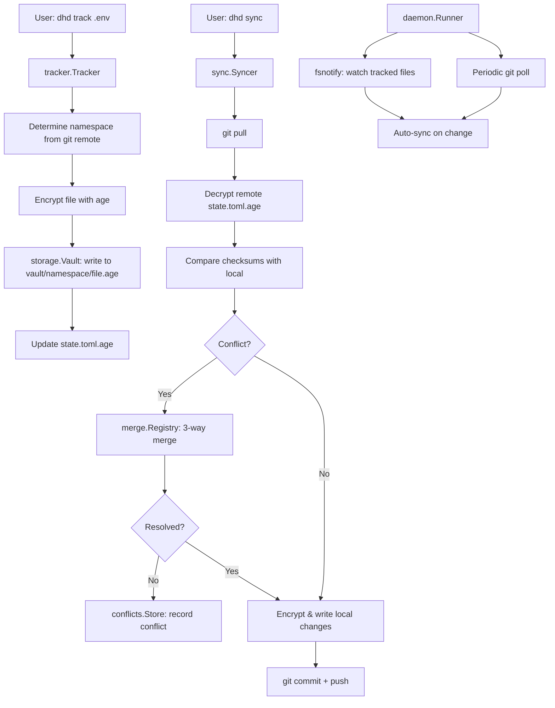

# DaemonHound Project Guide

## What is DaemonHound?

DaemonHound (`dhd`) is a **local-first, encrypted secret & config manager** for developers. It tracks files like `.env.local`, encrypts them with [age](https://age-encryption.org/), and syncs them across machines via **your own private Git repo**. No SaaS, no accounts, no third-party servers.

---

## Folder Structure Map

### `cmd/dhd/main.go` — Entry Point
The single binary entry point. Calls `internal/cmd.Execute()` which wires up the CLI.

### `internal/cmd/` — CLI Commands (cobra)
Every user-facing `dhd` subcommand lives here:

| File | Command | What It Does |
|---|---|---|
| `root.go` | `dhd` | CLI root, version, process locking |
| `init.go` | `dhd init` | Initialize vault & config |
| `track.go` | `dhd track` | Start tracking a file |
| `untrack.go` | `dhd untrack` | Stop tracking a file |
| `sync.go` | `dhd sync` | Pull + encrypt/push files |
| `clone.go` | `dhd clone` | Clone vault from remote |
| `status.go` | `dhd status` | Show tracked file status |
| `merge.go` | `dhd merge` | Resolve merge conflicts |
| `conflicts.go` | `dhd conflicts` | List pending conflicts |
| `secret.go` | `dhd secret` | Manage named secrets |
| `export.go` | `dhd export` | Export decrypted files |
| `export_identity.go` | `dhd export-identity` | Export age key for machine sharing |
| `filter.go` | `dhd filter` | Filter tracked files |
| `discover.go` | `dhd discover` | Find trackable files |
| `read.go` | `dhd read` | Read decrypted file content |
| `diff.go` | `dhd diff` | Show changes since last sync |
| `doctor.go` | `dhd doctor` | Diagnose configuration issues |
| `rekey.go` | `dhd rekey` | Re-encrypt with new key |
| `cleanup.go` | `dhd cleanup` | Remove stale files |
| `logout.go` | `dhd logout` | Clear keychain & lock |
| `machines.go` | `dhd machines` | List known machines |
| `ui.go` | `dhd ui` | Launch web UI |
| `daemon.go` | `dhd daemon` | Start background sync daemon |
| `vault_ops.go` | (internal) | Vault CRUD helpers |
| `helpers.go` | (internal) | Shared CLI helpers |
| `git.go` | (internal) | Git operation helpers for CLI |

### `internal/config/` — Configuration Layer
- `config.go` — Reads/writes `~/.dh/config.toml`. Manages machine identity, vault remote, namespace→directory bindings, daemon settings.
- `config_test.go` — Tests for config.

### `internal/models/` — Data Types
- `models.go` — Core types: `TrackedFile`, `VaultState`, `SecretFile`, `SecretVersion`, `SecretRef`, `MachineConfig`, `DaemonConfig`, `FileMode` (sync vs backup).

### `internal/storage/` — Vault I/O
- `storage.go` — The `Vault` struct: encrypt/decrypt files with age, read/write vault state (`state.toml.age`), manage file layout on disk.
- `storage_test.go` — Tests.

### `internal/tracker/` — File Tracking
- `tracker.go` — Tracks which files are watched, detects dirty state (checksum comparison), determines namespace from git remote.
- `tracker_test.go` — Tests.

### `internal/sync/` — Sync Orchestration
- `sync.go` — The `Syncer` orchestrates push/pull: pulls from git, decrypts remote state, compares checksums, encrypts & writes local changes, commits & pushes. The heart of the sync logic.

### `internal/git/` — Git Operations
- `git.go` — Thin wrapper around `git` CLI: clone, clone sparse, pull, push, commit, status, diff. Also handles conflict detection in git operations.

### `internal/merge/` — 3-Way Merge Engine
- `driver.go` — `Registry` of merge drivers. Tries drivers in priority order.
- `state.go` — `StateDriver` — merges `state.toml.age` (highest priority).
- `env.go` — `EnvDriver` — merges `.env`/`.env.*`/`.envrc` files line-by-line.
- `json.go` — `JSONDriver` — merges JSON files.
- `csv.go` — `CSVDriver` — merges CSV files.
- `text.go` — `TextDriver` — generic text line-by-line merge (fallback).
- `secret.go` — `SecretDriver` — merges secret files.

### `internal/conflicts/` — Conflict Management
- `conflicts.go` — `Conflict` model & `Store` (persists to `~/.dh/conflicts.json`).
- `tui.go` — Terminal UI for resolving conflicts interactively (bubbletea-based).

### `internal/daemon/` — Background Daemon
- `service.go` — OS service manager abstraction (launchd on macOS, systemd on Linux, Task Scheduler on Windows).
- `runner.go` — The daemon loop: watches files with fsnotify, periodically polls git remote, auto-syncs, detects conflicts.
- `launchd.go` — macOS launchd integration.
- `systemd.go` — Linux systemd integration.
- `windows.go` — Windows Task Scheduler integration.
- `logrotator.go` — Rotates daemon log files.

### `internal/web/` — Web UI
- `server.go` — HTTP server with session auth, routing setup.
- `handler_auth.go` — Login/logout handlers.
- `handler_dashboard.go` — Dashboard page.
- `handler_status.go` — Status page.
- `handler_secrets.go` — Secret management pages.
- `handler_files.go` — File browsing pages.
- `handler_conflicts.go` — Conflict resolution pages.
- `handler_settings.go` — Settings page.
- `util.go` — Web utility functions.
- `static/` — Embedded static assets (CSS, JS).
- `templates/` — Go HTML templates (dashboard, layout, login, settings, status, and sub-templates for conflicts, files, secrets).

### `internal/keychain/` — OS Keychain
- `keychain.go` — Stores/retrieves the master password in the OS keychain (macOS Keychain, Linux Secret Service, Windows Credential Manager).

### `internal/lock/` — Process Locking
- `lock.go` — PID-based file lock (`~/.dh/sync.lock`) to prevent concurrent `dhd sync` runs.

### `internal/utils/` — Utilities
- `crypto.go` — AES-GCM + scrypt for identity key derivation. Encrypts the age identity at rest.
- `crypto_test.go` — Crypto tests.
- `utils.go` — Helpers: path normalization, git repo detection, file existence checks.
- `utils_test.go` — Tests.

### `internal/audit/` — Audit Logging
- `audit.go` — Logs sync operations, key rotations, and other security-relevant events.

### `internal/output/` — Output Formatting
- `output.go` — Terminal output formatting (colors, tables, etc.).

### `web/templates/` & `web/static/` — Web UI Assets
- Go-embedded HTML templates and static files served by the web UI.

---

## How to Find Things

| If You Want To... | Look In... |
|---|---|
| Understand the data model | `internal/models/models.go` |
| See all CLI commands | `internal/cmd/*.go` |
| Understand how encryption works | `internal/storage/storage.go` + `internal/utils/crypto.go` |
| Understand the sync flow | `internal/sync/sync.go` |
| Understand how conflicts are resolved | `internal/merge/` + `internal/conflicts/` |
| Understand the daemon/background sync | `internal/daemon/runner.go` |
| Understand the web UI | `internal/web/server.go` + handler files |
| Understand how git is used | `internal/git/git.go` |
| Understand file tracking logic | `internal/tracker/tracker.go` |
| Understand configuration | `internal/config/config.go` |
| Add a new CLI command | `internal/cmd/` (create new file, register in `root.go`) |
| Add a new merge driver for a file type | `internal/merge/` (implement `Driver` interface, register in `driver.go`) |
| Build/release the project | `Makefile`, `Dockerfile`, `Dockerfile.goreleaser`, `scripts/` |
| Cross-platform daemon setup | `internal/daemon/launchd.go`, `systemd.go`, `windows.go` |

---

## Key Architectural Flows

### Sync Flow



### Daemon Flow

1. `daemon.Runner` starts and loads configuration from `~/.dh/config.toml`
2. Sets up `fsnotify` watchers on all tracked files (resolved via bindings)
3. Starts a periodic git remote poll timer
4. On file change: debounces, then triggers auto-sync
5. On git poll: checks for remote changes, pulls, and merges
6. Conflicts are recorded in `~/.dh/conflicts.json` for user resolution
7. Logs are rotated via `LogRotator`

### Encryption Flow

1. User provides a master password (stored in OS keychain via `internal/keychain/`)
2. Master password + identity salt → scrypt → AES-GCM key
3. AES-GCM key decrypts `~/.dh/identity.age` → age X25519 identity
4. age identity encrypts/decrypts all vault files (`*.age`)
5. Each tracked file gets SHA-256 checksum for change detection

---

## Configuration Files (on disk)

| Path | Purpose |
|---|---|
| `~/.dh/config.toml` | Machine config (machine ID, vault remote, bindings, daemon settings) |
| `~/.dh/identity.age` | Encrypted age identity (protected by master password → keychain) |
| `~/.dh/sync.lock` | PID lock file |
| `~/.dh/conflicts.json` | Pending conflict records |
| `vault/state.toml.age` | Encrypted index of all tracked files & secrets |
| `vault/<namespace>/<file>.age` | Encrypted tracked files |

---

## Dependencies

| Library | Purpose |
|---|---|
| `filippo.io/age` | File encryption (age-encryption.org) |
| `github.com/spf13/cobra` | CLI framework |
| `github.com/BurntSushi/toml` | TOML config parsing |
| `github.com/fsnotify/fsnotify` | File system watcher (daemon) |
| `github.com/charmbracelet/bubbletea` | Terminal UI framework |
| `github.com/charmbracelet/bubbles` | TUI components |
| `github.com/charmbracelet/lipgloss` | Terminal styling |
| `github.com/zalando/go-keyring` | OS keychain access |
| `golang.org/x/crypto` | scrypt, SSH, term |
| `github.com/google/uuid` | Machine ID generation |

---

## Build & Run

```bash
# Build
make build

# Run
dhd version
dhd init --remote git@github.com:you/my-vault.git
dhd track .env.local
dhd sync

# Run daemon
dhd daemon

# Launch web UI
dhd ui
```

---

## Repository Structure (Top-Level)

| Path | Purpose |
|---|---|
| `cmd/dhd/main.go` | Binary entry point |
| `internal/` | All application code (not importable externally) |
| `web/` | Embedded web UI assets (templates, static files) |
| `scripts/` | Build & release scripts |
| `build/` | macOS app bundle resources (Info.plist, icons) |
| `docs/` | Documentation |
| `images/` | Logo and images |
| `bin/` | Compiled binary output |
| `Dockerfile` | Container build |
| `Dockerfile.goreleaser` | GoReleaser container build |
| `Makefile` | Build automation |
| `install.sh` | One-line install script |
| `go.mod` | Go module definition |
